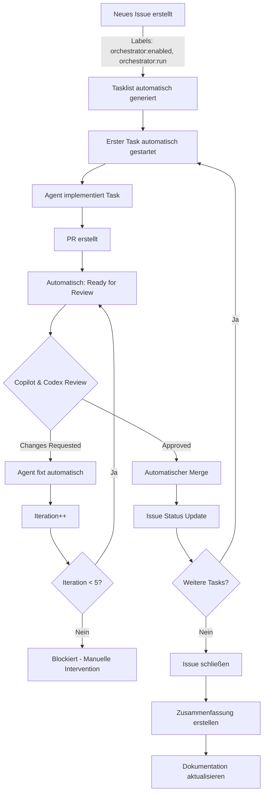

# Copilot Workflow Automation für FishIT-Mapper

## Übersicht

Die **Workflow Automation Konfiguration** (`.github/copilot/workflow-automation.json`) dokumentiert einen vollständig automatisierten Workflow für die Issue-Bearbeitung mit GitHub Copilot. Die Automation wird durch GitHub Actions (`.github/workflows/orchestrator.yml`) implementiert und koordiniert alle Schritte von der Issue-Erstellung bis zum finalen Merge und der Dokumentations-Aktualisierung.

**WICHTIG:** Dies ist eine Dokumentationsdatei, die die gewünschte Automation beschreibt. Sie ist KEIN offizielles GitHub Ruleset. GitHub Repository Rulesets werden über Settings > Branches > Rulesets im Repository konfiguriert, nicht über JSON-Dateien.

## Workflow-Übersicht



## Automatisierte Regeln

### 1. Tasklist-Generierung (`auto-issue-tasklist-generation`)

**Trigger:** Issue wird erstellt oder mit `orchestrator:enabled` + `orchestrator:run` gelabelt

**Aktionen:**
- Analysiert Issue-Beschreibung
- Erstellt strukturierte Tasklist in `codex/TODO_QUEUE.md`
- Initialisiert `codex/CHECKPOINT.md`
- Fügt Label `state:queued` hinzu
- Startet automatisch ersten Task

**Beispiel TODO_QUEUE.md:**
```markdown
# Orchestrator TODO Queue

## Current Issue: #42

- [ ] Implementiere User Authentication
- [ ] Füge Unit Tests hinzu
- [ ] Aktualisiere API Dokumentation
- [ ] Erstelle Migration Script
```

### 2. Erster Task automatisch starten (`auto-start-first-task`)

**Trigger:** Label `state:queued` wird gesetzt

**Aktionen:**
- Erstellt Branch `orchestrator/issue-{number}-{title}`
- Liest ersten Task aus `TODO_QUEUE.md`
- Weist Copilot Workspace Agent an, nur diesen Task zu implementieren
- Setzt Label auf `state:running`

### 3. Ready for Review (`auto-ready-for-review`)

**Trigger:** 
- PR erstellt/aktualisiert
- Agent kommentiert "task completed" oder ähnlich
- Checks sind grün

**Aktionen:**
- Fordert Reviews von `copilot-code-review` und `Copilot` an
- Setzt Label auf `state:needs-review`
- Postet Review-Checkliste

### 4. Automatisches Fixen von Review Findings (`auto-fix-review-findings`)

**Trigger:** Review mit "changes_requested"

**Aktionen:**
- Sammelt alle Review-Kommentare
- Weist Codex Agent an, alle Findings zu beheben
- Aktualisiert `CHECKPOINT.md` (Iteration++)
- Setzt Label auf `state:fixing`

**Beispiel Review-Fix Kommentar:**
```markdown
🔧 **Automatische Behebung von Review Findings**

@Copilot Bitte behebe ALLE folgenden Review-Kommentare:

1. In file.kt Zeile 42: Null-Check fehlt
2. In test.kt: Edge Case für leere Liste nicht getestet
3. In docs/API.md: Parameter-Beschreibung fehlt

Aktuelle Iteration: 2/5
```

### 5. Re-Review nach Fixes (`auto-re-review-after-fixes`)

**Trigger:** 
- Neue Commits nach Fixes
- Agent kommentiert "fixes applied"
- Checks sind grün

**Aktionen:**
- Triggert neues Review
- Setzt Label zurück auf `state:needs-review`
- Zeigt aktuelle Iteration an

### 6. Iterations-Limit Check (`auto-iteration-limit-check`)

**Trigger:** Review-Iteration > 5

**Aktionen:**
- Warnt über Iterations-Limit
- Setzt Label auf `state:blocked`
- Fordert manuelle Intervention

### 7. Automatischer Merge (`auto-merge-on-approval`)

**Trigger:**
- Review approved
- Checks grün
- Label `state:needs-review`
- Mindestens 1 Approval

**Aktionen:**
- Squash Merge des PRs
- Setzt Label auf `state:merged`
- Schließt Issue NICHT (erst wenn alle Tasks fertig)

**Merge Commit Message:**
```
<PR Title>

Closes #<issue_number>

<PR Body>

Iteration: 2/5
```

### 8. Issue-Status Update nach Merge (`auto-update-issue-after-merge`)

**Trigger:** PR wurde gemerged

**Aktionen:**
- Markiert Task in `TODO_QUEUE.md` als erledigt: `- [x]`
- Aktualisiert `CHECKPOINT.md` mit Merge-Info
- Kommentiert im Issue mit Statistiken
- Triggert nächsten Task

**Beispiel Issue-Kommentar:**
```markdown
✅ **Task erfolgreich abgeschlossen und gemerged!**

PR #123 wurde erfolgreich gemerged.

**Zusammenfassung:**
- Iteration: 2/5
- Merge Commit: abc123def
- Review-Runden: 2

Nächster Task wird automatisch gestartet...
```

### 9. Nächsten Task starten (`auto-start-next-task`)

**Trigger:** 
- PR gemerged
- Weitere unerledigte Tasks in `TODO_QUEUE.md`

**Aktionen:**
- Erstellt neuen Branch für nächsten Task
- Liest nächsten Task aus `TODO_QUEUE.md`
- Reset Iteration auf 1 in `CHECKPOINT.md`
- Startet Task-Implementierung
- Setzt Label auf `state:running`

### 10. Issue schließen (`auto-close-issue-when-complete`)

**Trigger:** 
- Letzter PR gemerged
- Alle Tasks in `TODO_QUEUE.md` erledigt

**Aktionen:**
- Erstellt Zusammenfassungs-Kommentar mit Statistiken
- Schließt Issue
- Setzt Label auf `status:completed`
- Triggert Dokumentations-Update

**Beispiel Zusammenfassung:**
```markdown
🎊 **Alle Tasks erfolgreich abgeschlossen!**

Alle Tasks aus der TODO_QUEUE wurden erfolgreich implementiert und gemerged.

**Statistiken:**
- Anzahl Tasks: 4
- PRs erstellt: 4
- Durchschnittliche Iterationen: 1.75
- Gesamtdauer: 2d 3h

@Copilot Erstelle nun eine Zusammenfassung und aktualisiere die Repository-Dokumentation.
```

### 11. Dokumentations-Update (`auto-documentation-update`)

**Trigger:** Issue geschlossen mit `status:completed`

**Aktionen:**
- Erstellt Branch `docs/auto-update-after-issue-{number}`
- Copilot Documentation Agent aktualisiert:
  - README.md (bei neuen Features)
  - ARCHITECTURE.md (bei Architektur-Änderungen)
  - docs/ROADMAP.md (Milestones markieren)
  - Neue Dokumentations-Seiten für Features
  - Code-Kommentare (KDoc)
- Erstellt PR mit allen Dokumentations-Updates

### 12. Follow-up Issues (`auto-create-follow-up-issue`)

**Trigger:** 
- Issue geschlossen
- `TODO_QUEUE.md` enthält "Future Tasks" Sektion

**Aktionen:**
- Erstellt neues Issue mit verbleibenden Tasks
- Kopiert Kontext vom Original-Issue
- Fügt Labels hinzu: `orchestrator:enabled`, `orchestrator:run`, `state:queued`
- Workflow startet automatisch für Follow-up

**Beispiel Follow-up Issue:**
```markdown
# Follow-up von Issue #42

Dieses Issue enthält die verbleibenden Tasks aus dem ursprünglichen Issue.

## Original Issue
https://github.com/karlokarate/FishIT-Mapper/issues/42

## Verbleibende Tasks
- [ ] Implementiere Admin Dashboard
- [ ] Füge Performance Monitoring hinzu
- [ ] Erstelle Deployment Pipeline

## Kontext
<Kontext aus Original-Issue>
```

### 13. Error Recovery (`auto-error-recovery`)

**Trigger:** 
- Check Suite fehlgeschlagen
- Labels: `state:running` oder `state:fixing`

**Aktionen:**
- Analysiert Fehler-Logs
- Codex Agent versucht automatische Behebung
- Bei 2. Fehler: Setzt `state:blocked`
- Fordert bei Blockierung manuelle Intervention

## Integration mit bestehendem Orchestrator

Das Ruleset **erweitert** den bestehenden GitHub Actions Orchestrator aus PR #5:

### Zusammenspiel

1. **Ruleset:** Definiert die Regeln und Trigger
2. **GitHub Actions Orchestrator:** Führt State Transitions durch
3. **Copilot Agents:** Implementieren die eigentliche Arbeit

### Workflow-Files

- `.github/workflows/orchestrator.yml` - Haupt-Orchestrator (aus PR #5)
- `.github/copilot/workflow-automation.json` - Workflow-Automation Dokumentation
- `.github/copilot/agents.json` - Agent-Konfiguration

### Checkpoint-System

Beide Systeme nutzen:
- `codex/CHECKPOINT.md` - Zustandsspeicherung
- `codex/TODO_QUEUE.md` - Task-Warteschlange

## Konfiguration

### Settings in workflow-automation.json

```json
{
  "settings": {
    "enabled": true,
    "max_iterations": 5,           // Max. Review-Iterationen
    "max_check_failures": 2,        // Max. Build-Fehler
    "merge_strategy": "squash",     // Merge-Strategie
    "auto_merge_enabled": true,     // Auto-Merge aktiviert
    "require_reviews": true,        // Reviews erforderlich
    "review_count": 1,              // Mindest-Anzahl Reviews
    "language": "de"                // Sprache für Kommentare
  }
}
```

### Labels

Alle erforderlichen Labels sind in `workflow-automation.json` definiert und werden vom Orchestrator verwendet:

**Required Labels:**
- `orchestrator:enabled` (grün)
- `orchestrator:run` (blau)

**State Labels:**
- `state:queued` (lila)
- `state:running` (gelb)
- `state:needs-review` (blau)
- `state:fixing` (orange)
- `state:passed` (grün)
- `state:merged` (violett)
- `state:blocked` (rot)
- `status:completed` (grün)

## Verwendung

### 1. Workflow ist bereits konfiguriert

Die Automation ist bereits eingerichtet:
- ✅ `.github/copilot/workflow-automation.json` - Dokumentiert die Automation-Logik
- ✅ `.github/workflows/orchestrator.yml` - Implementiert die Automation
- ✅ `.github/copilot/agents.json` - Konfiguriert die Copilot Agents

**WICHTIG:** GitHub Repository Rulesets (für Branch Protection) werden über Settings > Branches > Rulesets konfiguriert. Die Datei `workflow-automation.json` ist eine Dokumentation der Workflow-Logik, kein GitHub Ruleset.

### 2. Issue erstellen

Erstelle ein Issue mit:
- Klarer Beschreibung der Anforderungen
- Optionale Task-Liste (wird sonst automatisch generiert)

Füge Labels hinzu:
- `orchestrator:enabled`
- `orchestrator:run`

### 3. Automatischer Workflow startet

Der Workflow läuft vollständig automatisch:
1. ✅ Tasklist wird generiert
2. ✅ Erster Task startet
3. ✅ PR wird erstellt
4. ✅ Review wird angefordert
5. ✅ Fixes werden implementiert (max 5x)
6. ✅ Automatischer Merge
7. ✅ Nächster Task startet
8. ✅ Issue wird geschlossen
9. ✅ Dokumentation wird aktualisiert

### 4. Monitoring

Überwache den Fortschritt via:
- Issue-Kommentare (automatische Updates)
- `codex/CHECKPOINT.md` (aktueller Status)
- `codex/TODO_QUEUE.md` (abgeschlossene/offene Tasks)
- PR-Labels (aktueller State)

## Manuelle Intervention

### Workflow pausieren

Labels entfernen:
```
orchestrator:run
```

### Workflow fortsetzen

Labels wieder hinzufügen:
```
orchestrator:run
```

### Blockierung auflösen

1. Entferne `state:blocked`
2. Füge `state:fixing` hinzu
3. Workflow läuft weiter

### Iteration zurücksetzen

In `codex/CHECKPOINT.md`:
```markdown
**Iteration:** 1/5
```

## Best Practices

### Issue-Beschreibungen

✅ **Gut:**
```markdown
# Implementiere User Authentication

## Anforderungen
- JWT-basierte Auth
- Login/Logout Endpoints
- Token Refresh
- Role-Based Access Control

## Akzeptanzkriterien
- Tests mit >80% Coverage
- API Dokumentation aktualisiert
- Keine Breaking Changes
```

❌ **Schlecht:**
```markdown
Auth implementieren
```

### Task-Größe

- ✅ Tasks sollten 1-2h Arbeit sein
- ✅ Klar abgegrenzte Funktionalität
- ✅ Testbar und reviewbar
- ❌ Nicht mehrere Features in einem Task

### Labels

- ✅ Nur `orchestrator:enabled` und `orchestrator:run` manuell setzen
- ✅ State-Labels werden automatisch verwaltet
- ❌ Nicht manuell State-Labels ändern (außer bei Recovery)

## Troubleshooting

### Workflow startet nicht

**Prüfe:**
- [ ] Labels `orchestrator:enabled` + `orchestrator:run` gesetzt?
- [ ] `codex/TODO_QUEUE.md` existiert?
- [ ] Ruleset korrekt importiert?

### Stuck in state:running

**Ursachen:**
- PR nicht erstellt
- Checks laufen noch
- Agent wartet auf Input

**Lösung:**
- Prüfe PR-Status
- Prüfe Check-Logs
- Kommentiere manuell "task completed" wenn fertig

### Zu viele Iterationen

**Ursache:** Komplexe Review-Findings

**Lösung:**
- Manuelles Review und Merge
- Oder: Reset Iteration in `CHECKPOINT.md`
- Oder: Task in kleinere Teile aufteilen

### Agent fixt falsch

**Ursache:** Unklare Review-Kommentare

**Lösung:**
- Pause Workflow (`state:blocked`)
- Review-Kommentare präzisieren
- Manuell fixen
- Workflow fortsetzen

## Sicherheit

### Permissions

Copilot Agents benötigen:
- ✅ `contents: write` (Code-Änderungen)
- ✅ `pull-requests: write` (PR-Management)
- ✅ `issues: write` (Issue-Updates)
- ✅ `actions: write` (Workflow-Trigger)
- ❌ Kein `delete` Permission
- ❌ Kein `force-push` Permission

### Einschränkungen

In `agents.json` definiert:
- ✅ Keine Repository-Löschung
- ✅ Kein Force-Push
- ✅ Kein Branch-Löschen
- ✅ Kein Repository-Transfer

## Statistiken & Monitoring

Der Workflow sammelt automatisch Statistiken:

```markdown
**Statistiken:**
- Anzahl Tasks: 4
- PRs erstellt: 4
- Durchschnittliche Iterationen: 1.75
- Gesamtdauer: 2d 3h
- Erfolgsrate: 100%
- Automatische Fixes: 6
- Manuelle Interventionen: 0
```

Diese werden gespeichert in:
- Issue-Kommentare (bei Abschluss)
- `codex/CHECKPOINT.md` (laufend)

## Limits

### GitHub Actions Limits (Free Tier)

- ⏱️ 2000 Minuten/Monat
- 💾 500 MB Storage
- 🔄 20 concurrent Jobs

### Ruleset Limits

- ⚠️ Max. 5 Review-Iterationen (konfigurierbar)
- ⚠️ Max. 2 Build-Fehler (konfigurierbar)
- ⚠️ 1 Issue zur Zeit (sequentielle Verarbeitung)
- ⚠️ Workflow läuft stündlich (außer bei Events)

## Vergleich: Orchestrator vs. Ruleset

| Feature | GitHub Actions Orchestrator | Copilot Ruleset |
|---------|----------------------------|-----------------|
| **Trigger** | Schedule + Events | Events + Copilot Intelligence |
| **State Management** | CHECKPOINT.md | CHECKPOINT.md + Labels |
| **Task Distribution** | Manuell oder Script | Automatisch durch AI |
| **Review Handling** | Workflow-basiert | Agent-basiert |
| **Error Recovery** | Script-basiert | AI-basiert + Fallback |
| **Documentation** | Manuell | Automatisch |
| **Scope** | Infrastructure | Intelligence Layer |

**Zusammenspiel:** Ruleset nutzt Orchestrator für Execution, fügt aber AI-Layer hinzu.

## Weiterführende Links

- [GitHub Actions Orchestrator Dokumentation](./ORCHESTRATOR.md)
- [Copilot Agent Konfiguration](../.github/copilot/agents.json)
- [Repository Setup Guide](../COPILOT_SETUP.md)
- [Agent Quick Reference](../AGENT_QUICK_REFERENCE.md)

## Support

Bei Problemen:
1. Prüfe `codex/CHECKPOINT.md` für aktuellen Status
2. Prüfe Issue-Kommentare für Fehler-Details
3. Prüfe GitHub Actions Logs für Workflow-Fehler
4. Erstelle Issue mit Label `type:support`

---

**Version:** 1.0  
**Letzte Aktualisierung:** 2026-01-14  
**Maintainer:** @karlokarate
