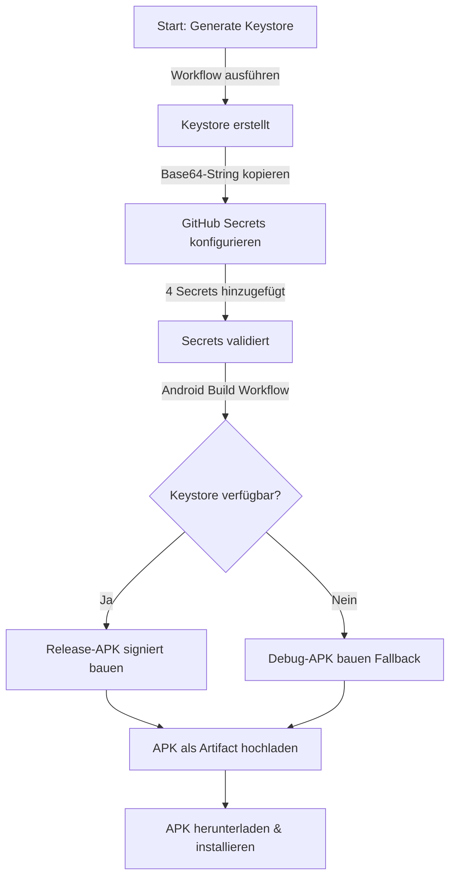

# Keystore & Signing Workflow - Quick Reference

## 🚀 Übersicht

Dieses Repository enthält nun einen vollständigen Workflow für Android App Signing mit automatischer Keystore-Generierung und GitHub Secrets Integration.

## 📦 Was wurde implementiert?

### 1. Neuer Workflow: `generate-keystore-secrets.yml`
**Zweck**: Automatische Keystore-Generierung für Android App Signing

**Features**:
- ✅ Manueller Trigger mit konfigurierbaren Parametern
- ✅ Keystore-Generierung mit `keytool` (RSA 2048-bit)
- ✅ Base64-Kodierung für GitHub Secrets
- ✅ Detaillierte Setup-Anleitung in Job-Summary
- ✅ Keystore als Artifact (7 Tage Retention)
- ✅ Sicherheitshinweise und Best Practices

**Verwendung**:
```
Actions → Generate Keystore and Secrets → Run workflow
```

**Inputs**:
- `keystore_password`: Keystore-Passwort (min. 6 Zeichen)
- `key_password`: Key-Passwort (min. 6 Zeichen)
- `key_alias`: Key-Alias (default: `fishit-mapper`)
- `validity_days`: Gültigkeit in Tagen (default: `10000` = ~27 Jahre)
- `dname`: Distinguished Name (default: `CN=FishIT Mapper,OU=Development,O=FishIT,L=Unknown,ST=Unknown,C=DE`)

**Outputs**:
- Base64-kodierter Keystore (im Job-Log)
- Detaillierte Setup-Anleitung (Job-Summary)
- Keystore-Datei (Artifact)

### 2. Erweiterter Workflow: `android-build.yml`
**Verbesserungen**:
- ✅ Automatische Keystore-Dekodierung mit Status-Tracking
- ✅ Bedingte Release/Debug Builds basierend auf Keystore-Verfügbarkeit
- ✅ Verbesserte Fehlerbehandlung
- ✅ Detaillierte Build-Summary mit Signing-Status
- ✅ Aussagekräftige Artifact-Namen (`app-release-signed`, `app-debug-unsigned`)

**Verhalten**:
- **Mit Keystore**: Signierte Release-APK wird gebaut
- **Ohne Keystore**: Debug-APK wird gebaut (Fallback)

### 3. Erweiterter Workflow: `build-app.yml`
**Neue Features**:
- ✅ Workflow-Input für Build-Typ (`debug`, `release`, `both`)
- ✅ Signing-Support für Release-Builds
- ✅ Parallele Release und Debug Builds
- ✅ Conditional Logic für Keystore-Verfügbarkeit

**Verwendung**:
```
Actions → Build Android App → Run workflow
→ Build Type: [debug | release | both]
```

### 4. Dokumentation
**Neu**: `docs/ANDROID_SIGNING_SETUP.md`
- Vollständiger Setup-Guide
- Schritt-für-Schritt Anleitung
- Troubleshooting-Sektion
- Sicherheitshinweise
- Lokale Entwicklung (optional)

**Aktualisiert**: `README.md`
- Quickstart-Sektion für Signing erweitert
- Link zur Signing-Dokumentation

## 🔐 Benötigte GitHub Secrets

Nach der Keystore-Generierung müssen folgende Secrets in GitHub konfiguriert werden:

| Secret Name | Beschreibung | Beispiel |
|------------|-------------|----------|
| `KEYSTORE_BASE64` | Base64-kodierter Keystore | `MIIJ...` (langer String) |
| `KEYSTORE_PASSWORD` | Keystore-Passwort | `MySecurePass123` |
| `KEY_ALIAS` | Key-Alias | `fishit-mapper` |
| `KEY_PASSWORD` | Key-Passwort | `MyKeyPass123` |

**Setup**: `Settings → Secrets and variables → Actions → New repository secret`

## 📋 Workflow: Von 0 bis zur signierten APK

### Schritt 1: Keystore generieren (einmalig)
1. **GitHub Actions öffnen**: `Actions` → `Generate Keystore and Secrets`
2. **Workflow starten**: `Run workflow`
3. **Parameter eingeben**:
   - Keystore Password: z.B. `MySecureKeystorePass123`
   - Key Password: z.B. `MySecureKeyPass123`
   - Key Alias: `fishit-mapper` (oder eigener Name)
   - Validity Days: `10000` (Standard: ~27 Jahre)
   - Distinguished Name: Standard-Wert oder anpassen
4. **Workflow abwarten**: ~30 Sekunden
5. **Base64-String kopieren**: Aus dem Step "Display Base64 Encoded Keystore"

### Schritt 2: GitHub Secrets konfigurieren (einmalig)
1. **Settings öffnen**: `Settings` → `Secrets and variables` → `Actions`
2. **Secrets hinzufügen**: `New repository secret` (4x klicken)
   - Secret 1: Name `KEYSTORE_BASE64`, Value: Base64-String aus Schritt 1
   - Secret 2: Name `KEYSTORE_PASSWORD`, Value: Keystore-Passwort
   - Secret 3: Name `KEY_ALIAS`, Value: Key-Alias (z.B. `fishit-mapper`)
   - Secret 4: Name `KEY_PASSWORD`, Value: Key-Passwort

### Schritt 3: Signierte APK bauen
1. **GitHub Actions öffnen**: `Actions` → `Android Build`
2. **Workflow starten**: `Run workflow`
3. **Workflow abwarten**: ~5-10 Minuten (Contract-Generierung + Build)
4. **APK herunterladen**: Unter "Artifacts" → `app-release-signed`
5. **Installation**: APK entpacken und auf Android-Gerät installieren

## 🔄 Workflow-Diagramm



## 🛠️ Build-Varianten

| Workflow | Build-Typ | Signing | Artifact-Name |
|----------|-----------|---------|---------------|
| `android-build.yml` | Auto (Release/Debug) | Abhängig von Secrets | `app-release-signed` oder `app-debug-unsigned` |
| `build-app.yml` (debug) | Debug | Nein | `app-debug` |
| `build-app.yml` (release) | Release | Ja (wenn Secrets) | `app-release-signed` |
| `build-app.yml` (both) | Debug + Release | Ja (Release) | Beide Artifacts |

## 🔒 Sicherheit

### ✅ Best Practices implementiert
- Keystore wird NICHT ins Repository committed (`.gitignore`)
- Secrets sind verschlüsselt in GitHub gespeichert
- Secrets werden nicht in Logs angezeigt
- Temporäre Keystore-Dateien werden automatisch gelöscht
- Keystore-Artifact hat nur 7 Tage Retention

### ⚠️ Wichtige Hinweise
- Base64-Keystore ist im Job-Log sichtbar → Alte Workflow-Runs löschen nach Secret-Konfiguration
- Für Production-Apps: Professionelles Key-Management verwenden
- Keystore-Backup erstellen und sicher aufbewahren
- Bei Keystore-Verlust: App-Updates nicht mehr möglich!

## 📚 Weitere Dokumentation

- **Vollständiger Setup-Guide**: [docs/ANDROID_SIGNING_SETUP.md](ANDROID_SIGNING_SETUP.md)
- **Troubleshooting**: Siehe `ANDROID_SIGNING_SETUP.md` → Troubleshooting-Sektion
- **Lokale Entwicklung**: Siehe `ANDROID_SIGNING_SETUP.md` → Lokale Entwicklung

## ✅ Checkliste für neues Setup

- [ ] Workflow "Generate Keystore and Secrets" ausgeführt
- [ ] Base64-Keystore aus Job-Log kopiert
- [ ] 4 GitHub Secrets konfiguriert:
  - [ ] `KEYSTORE_BASE64`
  - [ ] `KEYSTORE_PASSWORD`
  - [ ] `KEY_ALIAS`
  - [ ] `KEY_PASSWORD`
- [ ] Android Build Workflow getestet
- [ ] Signierte APK erfolgreich heruntergeladen
- [ ] APK auf Android-Gerät installiert und getestet
- [ ] Alte Workflow-Runs mit sichtbarem Base64-String gelöscht (optional)
- [ ] Keystore-Backup erstellt (optional aber empfohlen)

## 🎯 Ergebnis

✅ **Vollständige CI/CD Pipeline für signierte Android-Builds**
- Automatische Keystore-Generierung
- Sichere Secret-Verwaltung in GitHub
- Automatisches Signing in Build-Workflows
- Fallback auf Debug-Builds wenn kein Keystore
- Umfassende Dokumentation

---

**Status**: ✅ Implementation abgeschlossen und getestet
**Letztes Update**: 2026-01-19
